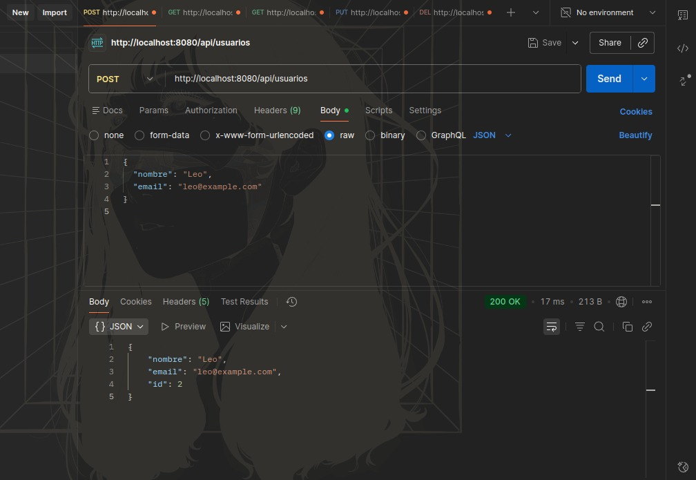
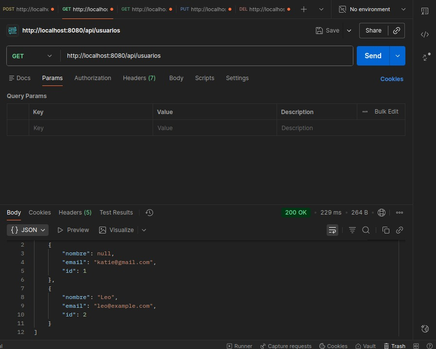
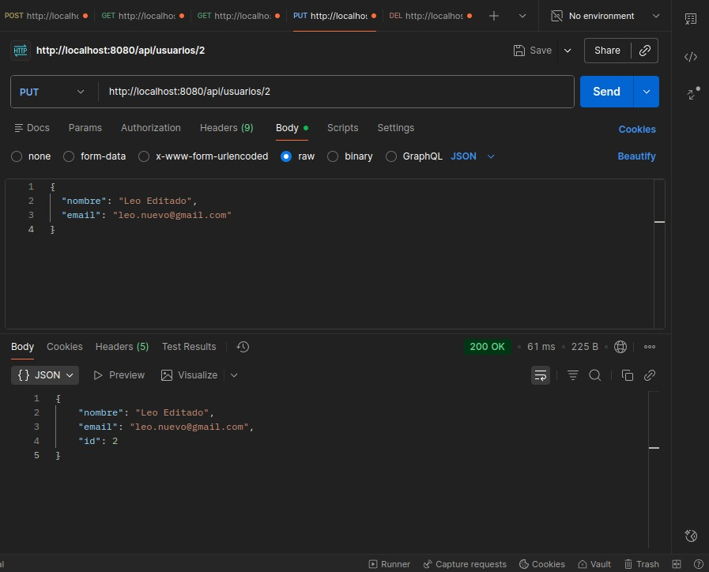
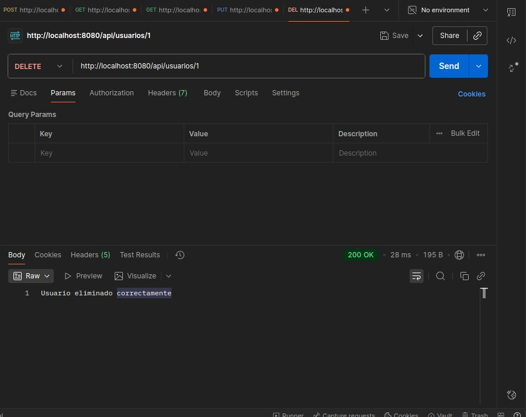
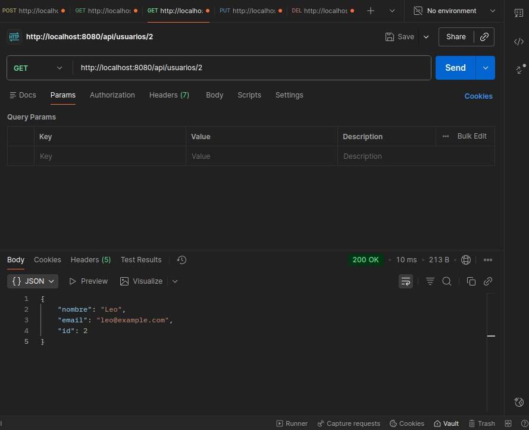

# 🧩 API REST – Gestión de Usuarios

API REST desarrollada con **Spring Boot** para la gestión de usuarios mediante operaciones **CRUD** completas.
Implementa arquitectura en capas, persistencia con **Spring Data JPA** y base de datos **MySQL**.

Proyecto backend enfocado en demostrar buenas prácticas de desarrollo y conocimientos fundamentales en Spring Framework.

---

## 🚀 Tecnologías utilizadas

- **Java 17**
- **Spring Boot 3**
    - Spring Web
    - Spring Data JPA
    - Jakarta Validation
- **Hibernate**
- **MySQL**
- **Maven**
- **Swagger / OpenAPI**
- **Postman** (pruebas de la API)
- **Git y GitHub**
---

## 🏗 Arquitectura

El proyecto sigue una arquitectura en capas, separando responsabilidades
para facilitar el mantenimiento y la escalabilidad:

- **Controller**: Maneja las peticiones HTTP y las respuestas de la API REST.
- **Service**: Contiene la lógica de negocio y las reglas de la aplicación.
- **Repository**: Acceso a datos utilizando Spring Data JPA.

---

## 📂 Estructura del proyecto
```
src/main/java/com/demo/api
├── controller          # Controladores REST
├── service             # Interfaces de servicio
├── service/impl        # Implementaciones de servicio
├── repository          # Repositorios JPA
├── model               # Entidades
└── DemoApiApplication.java
```

---

## 🗄 Persistencia

Se utiliza **Spring Data JPA** para abstraer el acceso a la base de datos,
evitando el uso de SQL directo y permitiendo trabajar con entidades y repositorios
de forma declarativa.
---
## ⚙️ Configuración del proyecto

### 1️⃣ Crear la base de datos
```sql
CREATE DATABASE usuarios_db;
```

### 2️⃣ Configurar `application.properties`
```properties
spring.datasource.url=jdbc:mysql://localhost:3306/usuarios_db?useSSL=false&serverTimezone=UTC
spring.datasource.username=TU_USUARIO
spring.datasource.password=TU_PASSWORD

spring.jpa.hibernate.ddl-auto=update
spring.jpa.show-sql=true
spring.jpa.properties.hibernate.format_sql=true
```

> Spring Boot creará automáticamente la tabla `usuarios` al iniciar la aplicación.

---

## ▶️ Ejecución del proyecto

1. Clonar el repositorio:
```bash
git clone https://github.com/AnderssonEspinoza/springboot-api-usuarios.git
cd springboot-api-usuarios
```

2. Abrir el proyecto en IntelliJ IDEA

3. Ejecutar la clase principal:
```
   DemoApiApplication.java
```

4. La API estará disponible en:
```
   http://localhost:8080
```

---

## 📌 Endpoints disponibles

### ➕ Crear usuario
**POST** `/api/usuarios`
```json
{
  "nombre": "Leo",
  "email": "leo@example.com"
}
```

### 📄 Listar usuarios
**GET** `/api/usuarios`

### 🔍 Obtener usuario por ID
**GET** `/api/usuarios/{id}`

### ✏️ Actualizar usuario
**PUT** `/api/usuarios/{id}`
```json
{
  "nombre": "Leo Editado",
  "email": "leo.nuevo@gmail.com"
}
```

### ❌ Eliminar usuario
**DELETE** `/api/usuarios/{id}`

---

## 🧪 Pruebas con Postman

La API fue probada utilizando **Postman**.  
El proyecto incluye una colección exportada para facilitar la ejecución de todas las peticiones sin configuración adicional.

📁 **Colección Postman:**  
`postman/postman_collection.json`

### Cómo usar la colección

1. Abrir Postman
2. **Import** → **File**
3. Seleccionar `postman/postman_collection.json`
4. Configurar la URL base (ej: `http://localhost:8080`)

### Evidencia de pruebas
A continuación se muestran capturas de las pruebas realizadas a los endpoints principales de la API:

### Crear usuario


### Listar usuarios


### Actualizar usuario


### Eliminar usuario


### Obtener usuario

---

## 📈 Estado del proyecto

- ✔ CRUD funcional
- ✔ Conexión exitosa con MySQL
- ✔ Persistencia con JPA
- ✔ Arquitectura en capas
- ✔ Variables de entorno para credenciales
- ✔ Validaciones de datos (`@NotBlank`, `@Email`)
- ✔ Manejo global de errores con `@ExceptionHandler`
- ✔ Documentación de la API con Swagger / OpenAPI
- ✔ Colección Postman para pruebas de endpoints
---

## 🧠 Próximas mejoras

- Tests unitarios con JUnit y Mockito
- Autenticación y autorización (Spring Security)
- Paginación y ordenamiento de resultados

---

## 👨‍💻 Autor

**Andersson Espinoza M.**

- 💼 GitHub: [@AnderssonEspinoza](https://github.com/AnderssonEspinoza)
- 💼 LinkedIn: [Andersson Espinoza M.](https://www.linkedin.com/in/tu-perfil)
- 📧 Email: anderssonjunior.29@gmail.com

---

## 📝 Licencia

Este proyecto es de código abierto y está disponible bajo la [Licencia MIT](LICENSE).

---

## 📞 Soporte

¿Necesitas ayuda? Contáctame:

- 📧 Email: anderssonjunior.29@gmail.com
- 💬 GitHub Issues: [Crear Issue](https://github.com/tu-usuario/tu-repositorio/issues)
- 💼 LinkedIn: [Mensaje directo](https://www.linkedin.com/in/tu-perfil)

---

<div align="center">

⭐ **Si este proyecto te fue útil, considera darle una estrella** ⭐
</div>

---

<div align="center">

Made with ❤️ by **Andersson Espinoza M.**

</div>
